# rain-prediction
In this project, I will develop a rain prediction application that leverages machine learning to forecast weather patterns. The application will be hosted on Google Cloud Platform (GCP) for robust scalability and availability. The infrastructure setup will be automated using Ansible to streamline the provisioning and configuration process. Additionally, monitoring and observability will be integrated using Prometheus and Grafana, both of which will be deployed on Google Kubernetes Engine (GKE) to ensure real-time tracking of application metrics and performance. This setup ensures that the application is both reliable and easy to maintain.
## How-to Guide
### 1. Create new project in Google Cloud and Service Account:
- [create new project](https://developers.google.com/workspace/guides/create-project)


- Access into the new project then generate new Service Accounts under IAM & Admin:

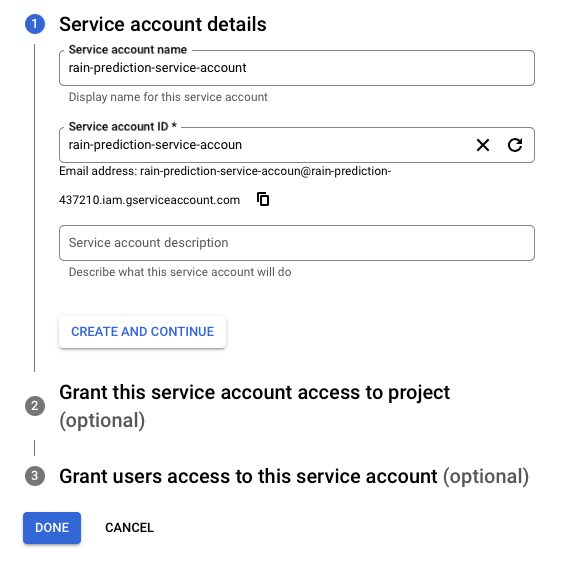

- Grant roles: "Compute Engine Service Agent" and "Kubernetes to this service account:
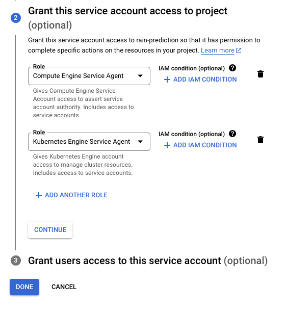

- Go to tab "Keys" and create new keys, select type as JSON:

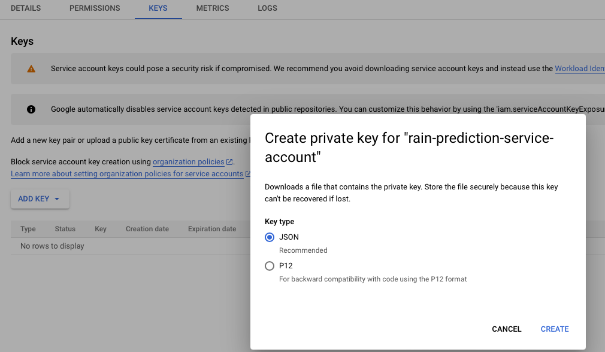

- Save the JSON file in folder "secrets"

### 2. Deploy application using Ansible:
- Change project name and secret file in this playbook: ansible/create_compute_instance.yml
- Run these commands:
```console
cd ansible
ansible-playbook create_compute_instance.yml
```
- The 2 new instances are now created. 
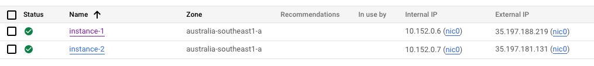
- Generate a new ssh key, then copy the instances' ip addresses and the path of the public key to "inventory" file

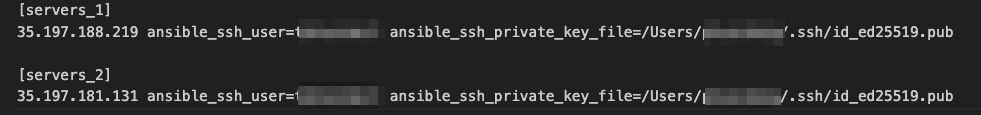

- Run this command to pull and install rain_prediction_app:
```
ansible-playbook -i ../inventory install_docker_deploy_app.yml
```

- You can access the app using port 30000

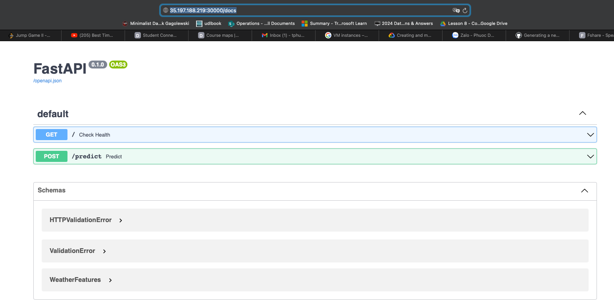

- Run demo on app by click on POST --> Try it out --> Execute

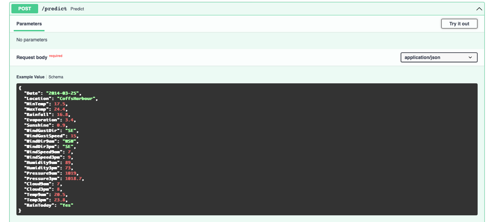

### 3. CI/CD with Jenkins and Github:

- Pull Jenkins docker and install

```
cd jenkins_docker
docker compose -f install_jenkins.yml up -d
```

- access Jenkins at port 8081:

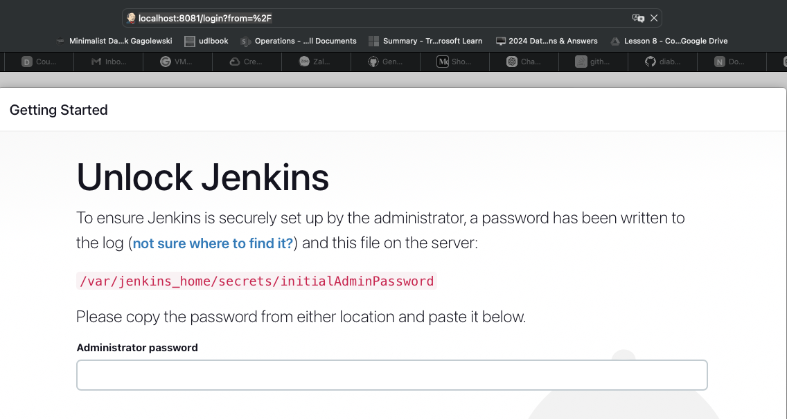

- to get the initial password, ssh to Jenkins instance:
```
docker logs jenkins
```
- copy the password, save it somewhere:
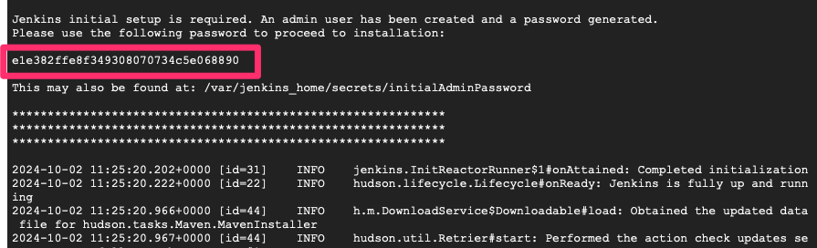
- install suggest plugins:
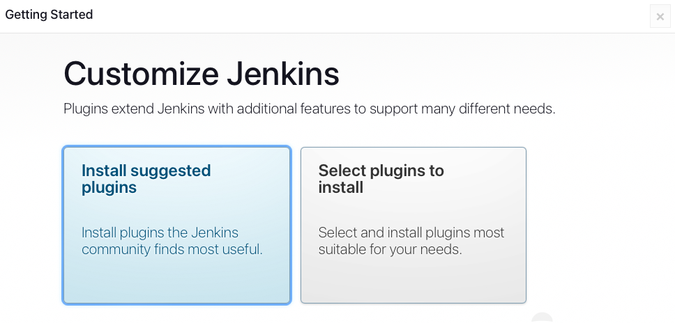
- install Ngrok to expose local server
[install Ngrok](https://ngrok.com/download)

- expose Jenkins
```
 ngrok http 8081
 ```
 - copy this address to your github:
 
 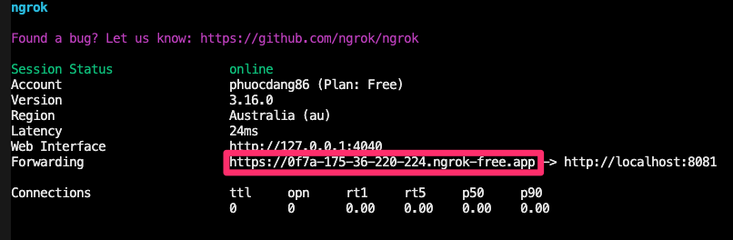
- add to github app repo in setting -> webhook:
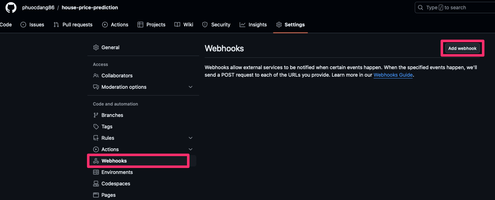
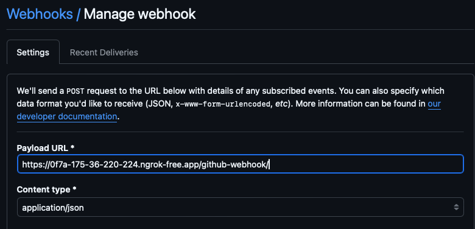

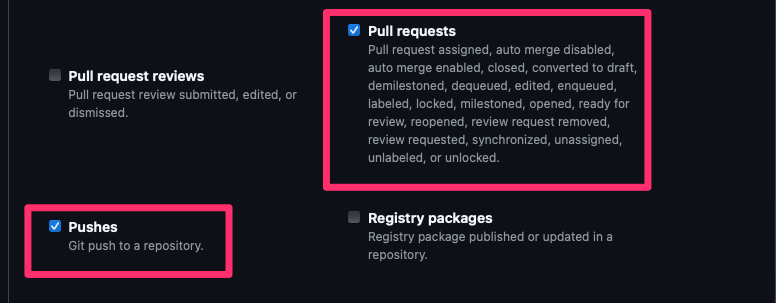
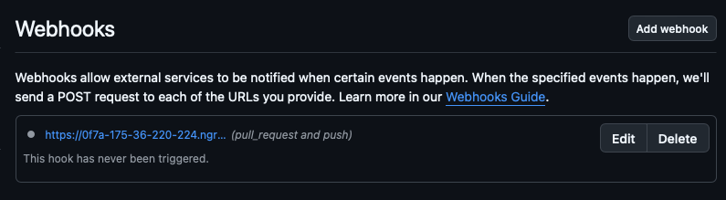
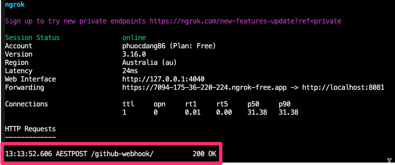

- Create new item in Jenkins:

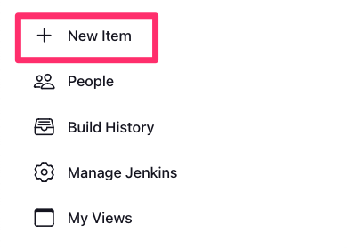
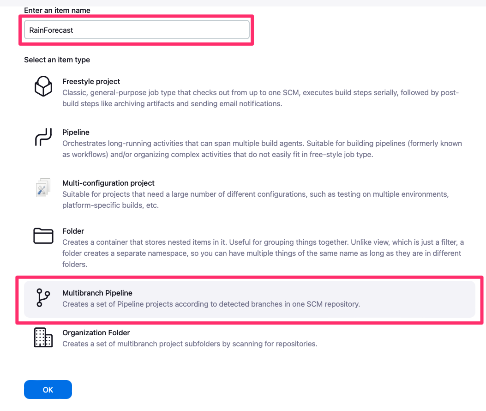
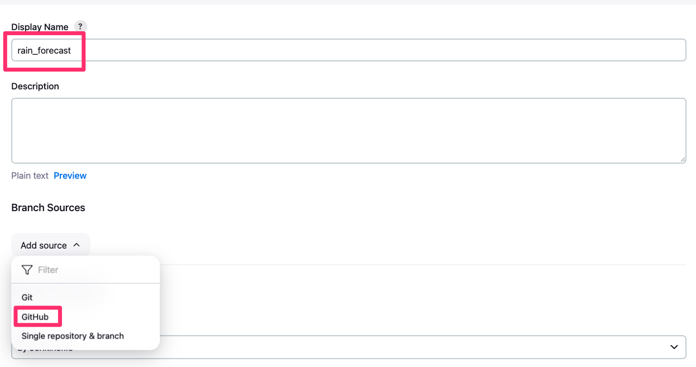

- generate a new token in github, fill in your github username & token, and click Save. You should be able to see your Github main branch.
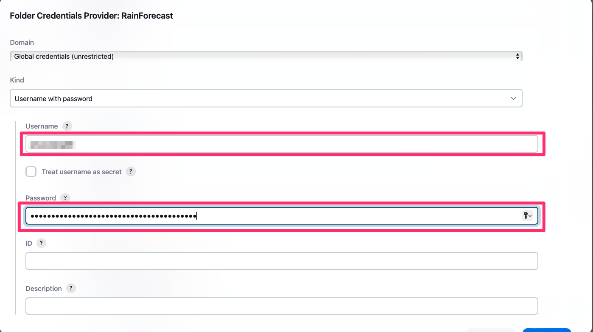

- Next step is to add Dockerhub credential to Jenkins. In your dockerhub, generate a new token:
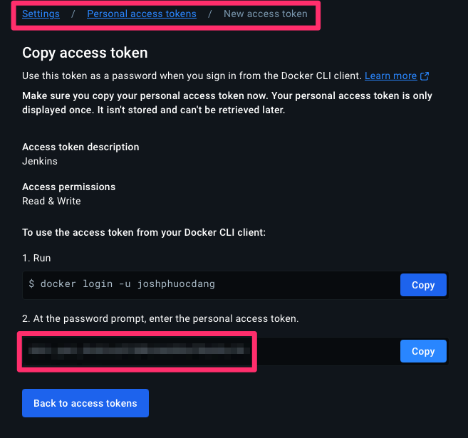

- Add Dockerhub credential:

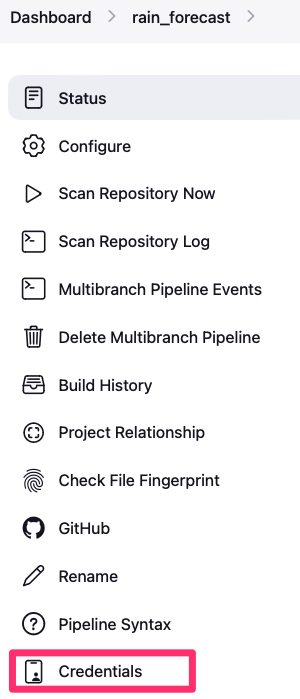

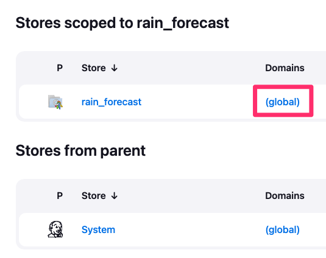

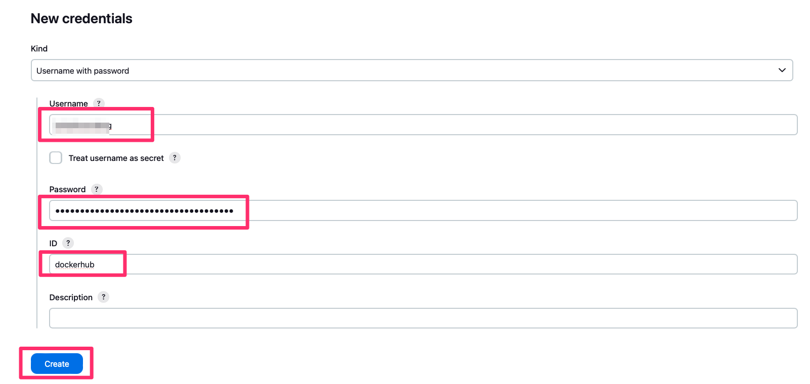

- When you push new update to Github, Jenkins should be able to capture changes:

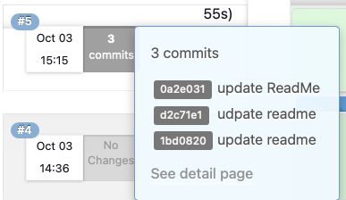

### 5. Google Kubernetes Engine:
#### 5.1 GKE + Jenkins
```
cd GKE_Jenkins
ansible-playbook create_Jenkins_instance.yml
```

- Copy ip address and paste into inventory file then

```
ansible-playbook -i ../inventory install_Jenkins.yml
```


