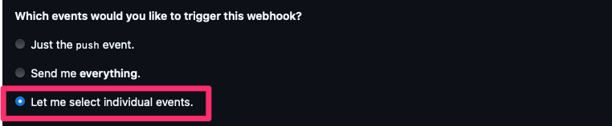
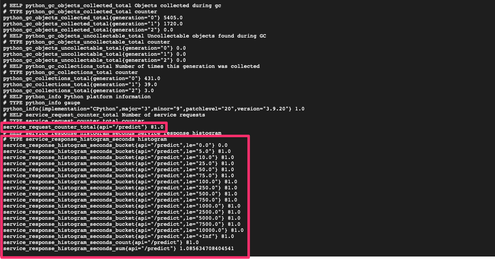

# rain-prediction
In this project, I will develop a rain prediction application that leverages machine learning to forecast weather patterns. The application will be hosted on Google Cloud Platform (GCP) for robust scalability and availability. The infrastructure setup will be automated using Ansible to streamline the provisioning and configuration process. Additionally, monitoring and observability will be integrated using Prometheus and Grafana, both of which will be deployed on Google Kubernetes Engine (GKE) to ensure real-time tracking of application metrics and performance. This setup ensures that the application is both reliable and easy to maintain.
## How-to Guide
### 1. Create new project in Google Cloud and Service Account:
- [create new project](https://developers.google.com/workspace/guides/create-project)


- Access into the new project then generate new Service Accounts under IAM & Admin:


- Grant roles: "Compute Engine Service Agent" and "Kubernetes to this service account:


- Go to tab "Keys" and create new keys, select type as JSON:


- Save the JSON file in folder "secrets"

### 2. Deploy application using Ansible:
- Change project name and secret file in this playbook: ansible/create_compute_instance.yml
- Run these commands:
```console
cd ansible
ansible-playbook create_compute_instance.yml
```
- The 2 new instances are now created. 

- Generate a new ssh key, then copy the instances' ip addresses and the path of the public key to "inventory" file


- Run this command to pull and install rain_prediction_app:
```
ansible-playbook -i ../inventory install_docker_deploy_app.yml
```

- You can access the app using port 30000


- Run demo on app by click on POST --> Try it out --> Execute


### 3. CI/CD with Jenkins and Github:

- Pull Jenkins docker and install

```
cd jenkins_docker
docker compose -f install_jenkins.yml up -d
```

- access Jenkins at port 8081:


- to get the initial password, ssh to Jenkins instance:
```
docker logs jenkins
```
- copy the password, save it somewhere:

- install suggest plugins:

- install Ngrok to expose local server
[install Ngrok](https://ngrok.com/download)

- expose Jenkins
```
 ngrok http 8081
 ```
 - copy this address to your github:
 
 
- add to github app repo in setting -> webhook:





- Create new item in Jenkins:


- generate a new token in github, fill in your github username & token, and click Save. You should be able to see your Github main branch.


- Next step is to add Dockerhub credential to Jenkins. In your dockerhub, generate a new token:


- Add Dockerhub credential:


- When you push new update to Github, Jenkins should be able to capture changes:


### 4. Monitoring System:
#### 4.1 Traces and Logs
In my monitoring system, **Jaeger** is used for distributed tracing to track the flow of requests across services, helping identify bottlenecks and performance issues. **Prometheus** collects and stores time-series metrics, enabling performance monitoring and alerting based on resource usage or service metrics. **Grafana** provides real-time dashboards that integrate both metrics from Prometheus and traces from Jaeger, offering a unified view of system performance and aiding in troubleshooting and optimization. Together, these tools ensure effective monitoring of your applications.

```
cd monitoring_systems
ansible-playbook prom_graf_docker.yml
```

- Jaeger running at port 16686, Prometheus at 9090 and Grafana at 3001.
- To get logs:
```
cd instrument/traces
python trace_automatic.py
```
- The app is running at port 8089. Execute some predictions, you'll see some logs in Jaeger:


#### 4.2 Prometheus Metrics
- I have created some simple metrics such as request counter and service response time. Prometheus metrics is running at port 8099, for visualization go to port 9090. I also generated a client file to repeatedly send request to the app.

```
cd instrument/metrics
python metrics.py
python client.py
```
- Prometheus metrics:



- Prometheus visualization:


#### 4.3 Grafana Dashboard:
- You can build your own dashboard using the metrics scraped from Prometheus or use Grafana built-in dashboard such as Cadvisor exporter (monitoring containers) or Node exporter (observing nodes)


### 5. Google Kubernetes Engine:
- Change Kubernetes Engine to Standard Mode, then create a cluster


- Authenticate and configure kubectl to interact with a Google Kubernetes Engine 
```
gcloud container clusters get-credentials rain-prediction-cluster --zone australia-southeast1-a --project rainforecast
```

- Check generated nodes:


```
kubectl create ns nginx-ingress
kubens nginx-ingress
helm upgrade --install nginx-ingress-controller ./GKE/nginx-ingress

```
- Install Prometheus and Grafana:

```
kubectl create -f ./monitoring_GKE/monitoring/prometheus/kubernetes/1.23/manifests/setup/
kubectl create -f ./monitoring_GKE/monitoring/prometheus/kubernetes/1.23/manifests/
kubectl apply -n monitoring -f ./monitoring_GKE/service_monitor/prometheus.yaml

kubens default
kubectl apply -f ./monitoring_GKE/service_monitor/servicemonitor.yaml
helm upgrade --install rain-prediction-api ./GKE/service_ingress


